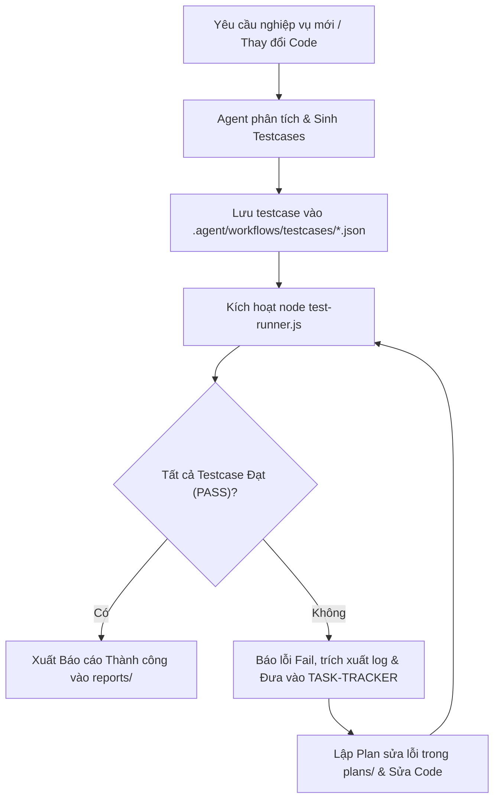

# Workflow: Kiểm Thử Tự Động & Sinh Testcase (Automated Testing & Testcase Generation)

- **Workflow ID**: WF-AUTO-TEST
- **Target Runtime**: Node.js v24+
- **Protocol**: HTTP/REST -> Spring Boot Backend (`http://localhost:8080`)
- **Report Target**: `.agent/workflows/reports/`

---

## 1. Quy Trình Vận Hành (End-to-End Test Loop)



---

## 2. Cấu Trúc File Testcase Tiêu Chuẩn (`.json`)
Mỗi testcase định nghĩa rõ ràng:
```json
{
  "suite": "Quản lý Bệnh nhân",
  "cases": [
    {
      "id": "TC-PAT-001",
      "name": "Lấy danh sách bệnh nhân thành công",
      "method": "GET",
      "endpoint": "/api/v1/benh-nhan",
      "expectedStatus": 200,
      "expectedBody": {
        "success": true
      }
    },
    {
      "id": "TC-PAT-002",
      "name": "Báo lỗi khi tạo bệnh nhân thiếu họ tên",
      "method": "POST",
      "endpoint": "/api/v1/benh-nhan",
      "body": {
        "gioiTinh": "M",
        "sdt": "0988888888"
      },
      "expectedStatus": 400
    }
  ]
}
```

---

## 3. Các Phân Hệ Được Kiểm Thử Tự Động
1. **Bệnh nhân & Tiếp nhận**:
   - Thêm mới bệnh nhân hợp lệ.
   - Bắt lỗi trùng lặp `SoCCCD`.
   - Tìm kiếm bệnh nhân theo từ khóa (tên, SĐT, CCCD).
2. **Khám bệnh & Sự kiện Y tế**:
   - Đăng ký khám với bác sĩ chuyên khoa hợp lệ.
   - Kiểm tra mã sự kiện sinh tự động theo quy tắc.
   - Đăng ký khám với bác sĩ không tồn tại -> Bắt lỗi 404.
3. **Đợt điều trị & Giường bệnh**:
   - Mở đợt điều trị và gán giường trống -> Kiểm tra giường chuyển thành `CoNguoi`.
   - Gán giường đã có người -> Bắt lỗi 400 / 409 `BusinessException`.
   - Đóng đợt điều trị -> Kiểm tra giường chuyển về `Trong`.
4. **Kho Dược & Tồn Kho**:
   - Kê đơn thuốc với số lượng nhỏ hơn tồn kho -> Thành công, tồn kho giảm chính xác.
   - Kê đơn thuốc vượt quá số lượng tồn kho -> Bắt lỗi giao dịch bị trigger từ chối.
5. **Hóa đơn & Thanh toán**:
   - Kiểm tra tổng tiền hóa đơn tự động bằng tổng các khoản mục.
   - Xác nhận thanh toán hóa đơn.
